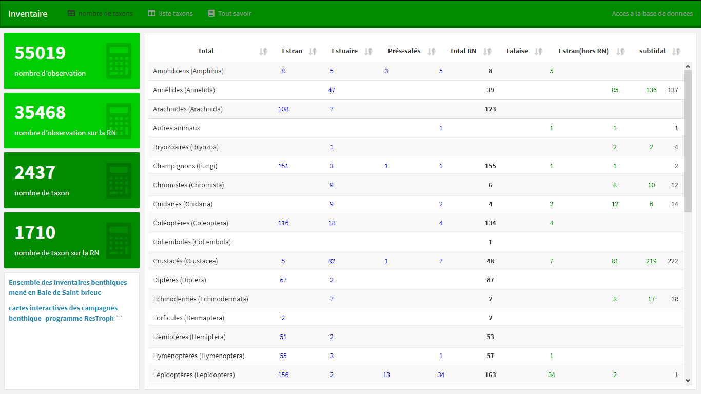
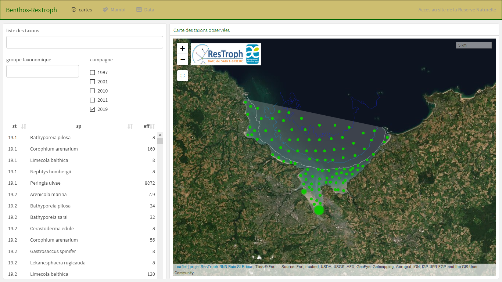

<style>                     
.navbar {
  background-color:#CCCCCC;
  border-color:#006400;}
  .navbar-inverse .navbar-nav > li > a:hover,
.navbar-inverse .navbar-nav > li > a:focus {
    background-color: #ec4f4f;
    color: black;}
.navbar-inverse .navbar-nav > .active > a,
.navbar-inverse .navbar-nav > .active > a:hover,
.navbar-inverse .navbar-nav > .active > a:focus {
  color: white;
  background-color: #851616;}
.navbar-brand {
color:white!important;}
.chart-title {
  color: #006400;}
.nav-tabs-custom > .nav-tabs > li.active {border-top-color: #CCCCCC}
.nav-tabs-custom .nav-tabs li.active a {color: blue;}
.nav-tabs-custom .nav-tabs li:not(.active) a { color: #8A857C;}
.chart-title {color: #006400;}
</style>

```{css my-content, echo = FALSE}
.value-box {
    height: 85%;}
```

```{r setup, include=FALSE}
library(flexdashboard)
#initialisation
library(readxl)
library(RODBC)
library(doBy)
####################################
#ouverture des data
taxo <- as.data.frame(read_excel(
  "C:/Serena2Data/SerenaR/taxo.xlsx",sheet = 1))
obsG <- as.data.frame(read_excel(
  "C:/Serena2Data/SerenaR/R-requPostgreSQL-RNF_OBSE.xlsx",
  sheet = 1))
#dans la base local benthos
adres<-getwd()
channel <-  odbcConnectAccess2007(gsub("RserenaSQL",  "BDE_BSBbio.mdb"  ,adres))
ind  <-  sqlFetch(channel, "BSB_BIOM",colnames = F, rownames = F)
close(channel)
###################################
maj<-strptime(max(obsG$OBSE_LMOD_DATH), '%Y-%m-%d %H:%M:%S')
MAJ<-strftime(maj,"%d/%m/%Y")
```

## Sidebar {.sidebar}

L'ensemble des cartes, des graphes et des analyses est produit automatiquement à partir des observations saisies dans notre base de données postgreSQL **SERENA2** (développé par Pierre Girard avec l'appui de Réserves Naturelles de France).

<hr/>


 <a href='http://www.serena-rnf.net/v2/' target='_blank'>En savoir plus sur **SERENA 2**</a>

<hr/>

Ensemble de pages web produites à partir de scripts

 `RSerena`

développé sous :

 & `Rmarkdown` 
<hr/>

### 

{width=80%}

## Row

### Nb d'observations

```{r}
valueBox(dim(obsG)[1]-1, icon = "fa-binoculars", color="#00BFFF",
         href="#details")
```

### Nb data biométriques

```{r}
valueBox(dim(ind)[1], icon = "fa-ruler",color="#00BFFF")
```

### Nb de taxon

```{r}
valueBox(dim(taxo)[1], icon = "ion-calculator",color="#0000CD" )
```

### dernière mise à jour

```{r}
valueBox(MAJ, icon = "fa-edit",color="#27408B")
```

### 16/09/2025

```{r}
valueBox("v7.5.0", icon = "ion-ios-monitor", color="#8EE5EE")
```

## Row {.tabset}

### **Inventaires**

*Le bilan et la liste exhaustive des espèces inventoriées à ce jour en baie de Saint-Brieuc :*

-   <a href='https://www.reservebaiedesaintbrieuc.com/sbaa_reservebaie/RSerena/inventaire.html' target='_blank'>**synthèse des inventaires**</a> (Nombres de taxons et listes des espèces inventoriées en fonction des habitats de la baie).

-   <a href='https://www.reservebaiedesaintbrieuc.com/sbaa_reservebaie/RSerena/inventaireLC.html' target='_blank'>**Ensemble des observations**</a> (L'intégralité des observations de notre base de données SERENA).

-   <a href='http://www.pierrehh.info/SerenAtlas.aspx?bd=jnhoegchniflcf' target='_blank'>**Atlas cartographique**</a> (SerenAltas).

<a href='https://www.reservebaiedesaintbrieuc.com/sbaa_reservebaie/RSerena/inventaireLC.html' target='_blank'></a>

### **Benthos**

*Le benthos est un élément clé dans le fonctionnement des écosystèmes littoraux et marins. Il sont une importante source de nourritures pour les niveaux trophiques supérieurs et assurent de ce fait un rôle fondamental dans le recyclage des nutriments :*

-   <a href='https://www.reservebaiedesaintbrieuc.com/sbaa_reservebaie/RSerena/Benthos-inventaires.html' target='_blank'>**Inventaires du benthos**</a> (La Réserve naturelle et ses partenaires mènent des programmes d'inventaires, de suivis de la dynamique de groupes d'espèces).

-   <a href='https://www.reservebaiedesaintbrieuc.com/sbaa_reservebaie/RSerena/Benthos-ResTroph.html' target='_blank'>**Campagnes benthiques**</a> (Cinq campagnes de prélèvements benthiques ont été conduites depuis 1987 sur l'espace intertidal du fond de baie de Saint-Brieuc et sutidal proche).

-   <a href='https://rnbaiestbrieuc.shinyapps.io/cartoBivalves/' target='_blank'>**Suivi annuel des mollusques bivalves**</a> (Evaluation spatiale des mollusques bivalves (*Scrobicularia plana, Limecola balthica,
Macomangulus tenuis, Fabulina fabulina, Cerastoderma edule, Donax vittatus...*) de la baie de Saint-Brieuc.

<a href='https://www.reservebaiedesaintbrieuc.com/sbaa_reservebaie/RSerena/Benthos-ResTroph.html' target='_blank'></a>

### **Ichtyofaune**

*Une campagne de prélèvement à été réalisés dans le cadre du programme ResTroph :*

-   <a href='https://www.reservebaiedesaintbrieuc.com/sbaa_reservebaie/RSerena/poisson-ResTroph.html' target='_blank'>**Campagne Ichtyofaune**</a> (Traits de chalut à perche réalisés en septembre 2019 en zone subtidale et intertidale)

### **Avifaune**


*Bilan du dernier comptage :*

-   <a href='https://www.reservebaiedesaintbrieuc.com/sbaa_reservebaie/RSerena/ornitho-bilan.html'>**Bilan**</a> (Résultats du dernier comptage et comparaison avec les précédants comptage et avec les comptage des années précédentes pour la même période).

-   <a href='https://www.reservebaiedesaintbrieuc.com/sbaa_reservebaie/RSerena/ornitho-VisuelBilanComptage.pdf' target='_blank'>**Bilan du comptage en image**</a> (Visualisation en image des principales espèces dénombrées).

-   <a href='https://www.reservebaiedesaintbrieuc.com/sbaa_reservebaie/RSerena/ornitho-BilanComptagePDF.pdf' target='_blank'>**Bilan en pdf**</a> (Une synthèse du comptage téléchargeable en pdf)

-   <a href='https://www.reservebaiedesaintbrieuc.com/sbaa_reservebaie/RSerena/ornitho-SitesObs.html' target='_blank'>**Où observer les oiseaux**</a> (Les meilleurs sites d'observation, quels sont les espèces observable actuellement, les espèces rares ou occasionnelles).

<hr/>
*Analyse :*

-   <a href='https://www.reservebaiedesaintbrieuc.com/sbaa_reservebaie/RSerena/ornitho-limicoles.html'>**Limicoles**</a> (Graphes mensuels d'évolution des effectifs des principales espèces de limicoles).

-   <a href='https://www.reservebaiedesaintbrieuc.com/sbaa_reservebaie/RSerena/ornitho-anatides.html'>**Anatidés**</a> (Graphes mensuels d'évolution des effectifs des principales espèces d'anatidés).

-   <a href='https://www.reservebaiedesaintbrieuc.com/sbaa_reservebaie/RSerena/ornitho-autres.html'>**Ardéidés, Podicipédidés...**</a> (Graphes mensuels d'évolution des effectifs des principales autres espèces).

<hr/>
*Autres comptages :*

-   <a href='https://www.reservebaiedesaintbrieuc.com/sbaa_reservebaie/RSerena/ornitho-Wetlands.html' target='_blank'>**Comptage Wetlands**</a> (Wetlands international organise un comptage coordonné de l'avifaune à l'échelle internationale depuis plus de 50 ans).

-   <a href='https://www.reservebaiedesaintbrieuc.com/sbaa_reservebaie/RSerena/ornitho-larides.html' target='_blank'>**Comptage Laridés**</a> (Mouettes et goélands se rassemblent en fond de baie pour y passer la nuit. Un dénombrement est conduit à la mi-décembre).

<hr/>
*Evolution et bilan :*

-   <a href='https://rnbaiestbrieuc.shinyapps.io/ornitho-synthese/' target='_blank'>**Synthèse ornithologique**</a> (Analyse interactive sur l'ensemble des espèces).

-   <a href='https://www.reservebaiedesaintbrieuc.com/sbaa_reservebaie/RSerena/ornitho-tableau-data.html'>**Tableaux et data**</a> (Bilans annuels et en hivernages, les espèces rares et l'ensemble des données).

<hr/>
-   <a href='https://www.reservebaiedesaintbrieuc.com/sbaa_reservebaie/RSerena/ornitho-doc.html' target='_blank'>**Documentation et information**</a> (Des brochures et des publications sont téléchargeable).

-   <a href='https://www.reservebaiedesaintbrieuc.com/sbaa_reservebaie/RSerena/Dates_comptage.pdf' target='_blank'>**Dates de comptage**</a> (Les dates des comptages pour l'année en cours)

<hr/>
-   <a href='https://www.reservebaiedesaintbrieuc.com/sbaa_reservebaie/RSerena/LectureBagues.html' target='_blank'>**Lecture de bagues**</a></font> (Bécasseaux maubèches, sanderling, sterne caugek, Goéland cendré...).

### **Mammifères**

*Objectifs Phoques ! :*

-   <a href='https://reservenatbaiestbrieuc.shinyapps.io/phoque/' target='_blank'>**Les données du programme et saisisez vos observations**</a> La présence de phoques veau-marin est régulière en baie de Saint-Brieuc.Le projet vise à améliorer la connaissance et la protection des phoques, grâce à l’analyse des données existantes et la mobilisation des naturalistes. 

### **Paysages**

*C'est dans l'optique observer les évolutions des paysages qu'un observatoire photographiques a vu le jour en 2014 sur la Réserve naturelle*

-   <a href='https://www.reservebaiedesaintbrieuc.com/sbaa_reservebaie/RSerena/OPP.html' target='_blank'>**Observatoire photographique de l'évolution des paysages de la Réserve Naturelle Nationale de la Baie de Saint-Brieuc**</a></font> (carte interactive).

-   <a href='https://www.saintbrieuc-armor-agglo.bzh/fileadmin/RESERVE_DE_LA_BAIE/DOCUMENTATION/rapports_scientifiques/observatoire-photographie-paysages.pdf' target='_blank'>**Rapport complet en pdf**</a></font> (mis à jour annuellement).

### **Physico-chimie**

<hr/>

*Face aux bouleversements climatiques que subissent les écosystèmes, un suivi de la température et des paramètres physico-chimiques a été mis en place afin de mieux comprendre l’évolution du milieu, détecter les perturbations et orienter les actions de gestion et de conservation :* 

-   <a href='https://www.reservebaiedesaintbrieuc.com/sbaa_reservebaie/RSerena/tempSuface.html' target='_blank'>**Evaluation de la température de la lame d'eau** </a></font> (mesure bimensuel de la température de l'eau à St Guimond).

-   <a href='https://reservenatbaiestbrieuc.shinyapps.io/sonde_multiParam/' target='_blank'>**Sonde multiparamètres** </a></font> (Suivi de la dynamique des paramètres physicochimiques de la masse d’eau (Température, pH, Turbidité, Oxygène, Chlorophylle a, Salinité) en zone subtidale).


### **Outils**

<hr/>
*Applications 'shiny' développée par la Réserve naturelle :*

-   <a href='https://rnbaiestbrieuc.shinyapps.io/carl/' target='_blank'>**CARL** </a></font> (Cartographie et Analyse des Ressources Littorales est une application afin de cartographier et de modeliser les populations d'espèces benthiques des estrans meubles).

-   <a href='https://rnbaiestbrieuc.shinyapps.io/xyRcarto/' target='_blank'>**xyRcarto** </a></font> (Convertisseur de coordonnées géographique).

