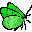

<style>                     
.navbar {
  background-color:#4682B4;
  border-color:#006400;}
  .navbar-inverse .navbar-nav > li > a:hover,
.navbar-inverse .navbar-nav > li > a:focus {
    background-color: #0686f0;
    color: black;}
.navbar-inverse .navbar-nav > .active > a,
.navbar-inverse .navbar-nav > .active > a:hover,
.navbar-inverse .navbar-nav > .active > a:focus {
  color: white;
  background-color: #0d416d;}
.navbar-brand {
color:white!important;}
.chart-title {
  color: #006400;}
.nav-tabs-custom > .nav-tabs > li.active {border-top-color: blue}
.nav-tabs-custom .nav-tabs li.active a {color: blue;}
.nav-tabs-custom .nav-tabs li:not(.active) a { color: #666461;}
.chart-title {color: #006400;}
</style>

```{r setup, include=FALSE}
library(flexdashboard)

```


Tout savoir {data-icon="fa-book"}
=====================================

Column {data-width=200}
-----------------------------------------------------------------------
###

*Bilan du dernier comptage :*


<a href='https://www.reservebaiedesaintbrieuc.com/sbaa_reservebaie/RSerena/ornitho-bilan.html' >**Bilan**</a> 

<a href='https://www.reservebaiedesaintbrieuc.com/sbaa_reservebaie/RSerena/VisuelBilanComptage.pdf' target='_blank'>**Bilan du comptage en image**</a>

<a href='https://www.reservebaiedesaintbrieuc.com/sbaa_reservebaie/RSerena/ornitho-BilanComptagePDF.pdf' target='_blank'>**Bilan en pdf**</a>

<a href='https://www.reservebaiedesaintbrieuc.com/sbaa_reservebaie/RSerena/ornitho-SitesObs.html' target='_blank'>**Où observer les oiseaux**</a>

<hr/>
*Analyse :*


<a href='https://www.reservebaiedesaintbrieuc.com/sbaa_reservebaie/RSerena/ornitho-limicoles.html' target='_blank'>**Limicoles**</a>

<a href='https://www.reservebaiedesaintbrieuc.com/sbaa_reservebaie/RSerena/ornitho-anatides.html' target='_blank'>**Anatidés**</a>

<a href='https://www.reservebaiedesaintbrieuc.com/sbaa_reservebaie/RSerena/ornitho-autres.html' target='_blank'>**Ardéidés, Podicipédidés...`**</a>

<hr/>
*Autres comptages :*

<a href='https://www.reservebaiedesaintbrieuc.com/sbaa_reservebaie/RSerena/ornitho-Wetlands.html' target='_blank'>**Comptage Wetlands**</a>

<a href='https://www.reservebaiedesaintbrieuc.com/sbaa_reservebaie/RSerena/ornitho-larides.html' target='_blank'>**Comptage Laridés**</a>

<hr/>
*Evolution et bilan :*

<a href='https://rnbaiestbrieuc.shinyapps.io/ornitho-synthese/' target='_blank'>**Synthèse ornithologique**</a>

<a href='https://www.reservebaiedesaintbrieuc.com/sbaa_reservebaie/RSerena/ornitho-tableau-data.html' target='_blank'>**Tableaux et data**</a>

<hr/>
<font size="4">
<a href='https://www.reservebaiedesaintbrieuc.com/sbaa_reservebaie/RSerena/ornitho-doc.html'>`Documentation et information`</a></font>

<hr/>
<a href='https://www.reservebaiedesaintbrieuc.com/sbaa_reservebaie/RSerena/Dates_comptage.pdf' target='_blank'>**Dates de comptage**</a>

Column {data-width=400}
-----------------------------------------------------------------------

### **Origine des données :**

- Depuis les années 70, les ornithologues suivent les populations d'oiseaux qui fréquentent la baie de Saint-Brieuc.

- Un dénombrement du peuplement ornithologique de la Réserve naturelle nationale de la Baie de Saint-Brieuc est réalisé une à deux fois par mois en fonction des conditions de marée. Couplées à des observations plus ponctuelles réalisées par des ornithologues bénévoles et l'équipe de la Réserve, ces opérations de comptage permettent de suivre la distribution des effectifs au cours de la saison, et de mettre en évidence l'importance de la Baie en matière d'hivernage et de halte migratoire.

- Les organismes impliqués dans le comptage de l'avifaune
en Baie de Saint-Brieuc :


Column {data-width=400}
-----------------------------------------------------------------------
### **Importance de la baie**
- La baie de Saint-Brieuc représente principalement une zone d'hivernage, **de novembre à février pour les anatidés**, et **d'octobre à mars pour les limicoles**. 

- C'est une escale migratoire pré-nuptiale **en mars-avril**, et post-nuptiale **en août-septembre** pour les limicoles. C'est une zone refuge climatique en cas de vague de froid sur l'Europe (tadorne de belon, canard siffleur, huîtrier pie, pluvier argenté, barge rousse, courlis cendré)...

- La baie a une responsabilité élevée dans la conservation des zones de reposoirs et de dortoirs des laridés (Mouette rieuse, Mouette mélanocéphale, Goéland cendré, Goéland brun, Goéland argenté, Goéland marin, Sterne caugek) en particulier **au cours de l'estivale**.

- Les oiseaux exploitent le milieu pour la fonction de nourrissage, de repos, et certains pour la nidification.


Column {data-width=200}
-----------------------------------------------------------------------

### __Réalisation :__
L'ensemble de ces analyses est produit automatiquement à partir des observations saisies dans notre base de données postgreSQL **SERENA2** (développé par Pierre Girard avec l'appui de Réserves Naturelles de France).


`Serena2`

à partir de scripts 

 
`RSerena`

développé sous : 

 & `Rmarkdown`  


Documentation {data-icon="fa-book-open"}
=====================================

Column {data-width=200}
-----------------------------------------------------------------------
###

*Bilan du dernier comptage :*


<a href='https://www.reservebaiedesaintbrieuc.com/sbaa_reservebaie/RSerena/ornitho-bilan.html'>**Bilan**</a> 

<a href='https://www.reservebaiedesaintbrieuc.com/sbaa_reservebaie/RSerena/ornitho-VisuelBilanComptage.pdf' target='_blank'>**Bilan du comptage en image**</a>

<a href='https://www.reservebaiedesaintbrieuc.com/sbaa_reservebaie/RSerena/ornitho-BilanComptagePDF.pdf' target='_blank'>**Bilan en pdf**</a>

<a href='https://www.reservebaiedesaintbrieuc.com/sbaa_reservebaie/RSerena/ornitho-SitesObs.html' target='_blank'>**Où observer les oiseaux**</a>

<hr/>
*Analyse :*


<a href='https://www.reservebaiedesaintbrieuc.com/sbaa_reservebaie/RSerena/ornitho-limicoles.html'>**Limicoles**</a>

<a href='https://www.reservebaiedesaintbrieuc.com/sbaa_reservebaie/RSerena/ornitho-anatides.html'>**Anatidés**</a>

<a href='https://www.reservebaiedesaintbrieuc.com/sbaa_reservebaie/RSerena/ornitho-autres.html'>**Ardéidés, Podicipédidés...`**</a>

<hr/>
*Autres comptages :*

<a href='https://www.reservebaiedesaintbrieuc.com/sbaa_reservebaie/RSerena/ornitho-Wetlands.html' target='_blank'>**Comptage Wetlands**</a>

<a href='https://www.reservebaiedesaintbrieuc.com/sbaa_reservebaie/RSerena/ornitho-larides.html' target='_blank'>**Comptage Laridés**</a>

<hr/>
*Evolution et bilan :*

<a href='https://rnbaiestbrieuc.shinyapps.io/ornitho-synthese/' target='_blank'>**Synthèse ornithologique**</a>

<a href='https://www.reservebaiedesaintbrieuc.com/sbaa_reservebaie/RSerena/ornitho-tableau&data'>**Tableaux et data**</a> 

<hr/>
<font size="4">
<a href='https://www.reservebaiedesaintbrieuc.com/sbaa_reservebaie/RSerena/ornitho-doc.html' target='_blank'>`Documentation et information`</a></font>

<hr/>
<a href='https://www.reservebaiedesaintbrieuc.com/sbaa_reservebaie/RSerena/Dates_comptage.pdf' target='_blank'>**Dates de comptage**</a>


Column {data-width=200}
-----------------------------------------------------------------------
<font size="4" color= #006400>**Fiches :** </font>

**Limicoles :**

- <a href='https://www.reservebaiedesaintbrieuc.com/fileadmin/RESERVE_DE_LA_BAIE/DOCUMENTATION/fiche/Huitrier_pie.pdf'target='_blank'>*Huîtrier-pie*</a>
- <a href='https://www.reservebaiedesaintbrieuc.com/fileadmin/RESERVE_DE_LA_BAIE/DOCUMENTATION/fiche/Courlis_cendre.pdf'target='_blank'>*Courlis cendré*</a>
- <a href=https://www.reservebaiedesaintbrieuc.com/fileadmin/RESERVE_DE_LA_BAIE/DOCUMENTATION/fiche/Barge_rousse.pdf'target='_blank'>*Barge rousse*</a>
- <a href='https://www.reservebaiedesaintbrieuc.com/fileadmin/RESERVE_DE_LA_BAIE/DOCUMENTATION/fiche/Becasseau_variable.pdf'target='_blank'>*Bécasseau variable*</a>
- <a href='https://www.reservebaiedesaintbrieuc.com/fileadmin/RESERVE_DE_LA_BAIE/DOCUMENTATION/fiche/Becasseau_sanderling.pdf'target='_blank'>*Bécasseau sanderling*</a>
- <a href='https://www.reservebaiedesaintbrieuc.com/fileadmin/RESERVE_DE_LA_BAIE/DOCUMENTATION/fiche/Becasseau_maubeche'target='_blank'>*Bécasseau maubèche*</a>
- <a href='https://www.reservebaiedesaintbrieuc.com/fileadmin/RESERVE_DE_LA_BAIE/DOCUMENTATION/fiche/Grand_Gravelot.pdf'target='_blank'>*Grand gravelot*</a>
- <a href='https://www.reservebaiedesaintbrieuc.com/fileadmin/RESERVE_DE_LA_BAIE/DOCUMENTATION/fiche/tournepierre.pdf'target='_blank'>*tournepierre à collier*</a>
- <a href='https://www.reservebaiedesaintbrieuc.com/fileadmin/RESERVE_DE_LA_BAIE/DOCUMENTATION/fiche/Chevalier_aboyeur.pdf'target='_blank'>*Chevalier aboyeur*</a>
- <a href='https://www.reservebaiedesaintbrieuc.com/fileadmin/RESERVE_DE_LA_BAIE/DOCUMENTATION/fiche/Chevalier_combattant.pdf'target='_blank'>*Chevalier combattant*</a>
- <a href='https://www.reservebaiedesaintbrieuc.com/fileadmin/RESERVE_DE_LA_BAIE/DOCUMENTATION/fiche/Chevalier_gambette.pdf'target='_blank'>*Chevalier gambette*</a>
- <a href=https://www.reservebaiedesaintbrieuc.com/fileadmin/RESERVE_DE_LA_BAIE/DOCUMENTATION/fiche/Chevalier_guignette.pdf'target='_blank'>*Chevalier guignette*</a>
- <a href='https://www.reservebaiedesaintbrieuc.com/fileadmin/RESERVE_DE_LA_BAIE/DOCUMENTATION/fiche/Pluvier_argente.pdf'target='_blank'>*Pluvier argenté*</a>
- <a href='https://www.reservebaiedesaintbrieuc.com/fileadmin/RESERVE_DE_LA_BAIE/DOCUMENTATION/fiche/Pluvier_dore.pdf'target='_blank'>*Pluvier doré*</a>
- <a href='https://www.reservebaiedesaintbrieuc.com/fileadmin/RESERVE_DE_LA_BAIE/DOCUMENTATION/fiche/Vanneau_huppe.pdf'target='_blank'>*Vanneau huppé*</a>
<hr/>

**Ardéidés :**

- <a href='https://www.reservebaiedesaintbrieuc.com/fileadmin/RESERVE_DE_LA_BAIE/DOCUMENTATION/fiche/Aigrette_garzette.pdf'target='_blank'>*Aigrette garzette*</a>
- <a href='https://www.reservebaiedesaintbrieuc.com/fileadmin/RESERVE_DE_LA_BAIE/DOCUMENTATION/fiche/Heron_cendre.pdf'target='_blank'>*Heron cendre*</a>
- <a href='https://www.reservebaiedesaintbrieuc.com/fileadmin/RESERVE_DE_LA_BAIE/DOCUMENTATION/fiche/Heron_garde-boeufs.pdf'target='_blank'>*Heron garde-boeufs*</a>
<hr/>

Column {data-width=200}
-----------------------------------------------------------------------


**Anatidés :**

- <a href='https://www.reservebaiedesaintbrieuc.com/fileadmin/RESERVE_DE_LA_BAIE/DOCUMENTATION/fiche/Bernache_cravant.pdf'target='_blank'>*Bernache cravant*</a>
- <a href=https://www.reservebaiedesaintbrieuc.com/fileadmin/RESERVE_DE_LA_BAIE/DOCUMENTATION/fiche/Canard_colvert.pdf'target='_blank'>*Canard colvert*</a>
- <a href='https://www.reservebaiedesaintbrieuc.com/fileadmin/RESERVE_DE_LA_BAIE/DOCUMENTATION/fiche/Canard_siffleur.pdf'target='_blank'>*Canard siffleur*</a>
- <a href='https://www.reservebaiedesaintbrieuc.com/fileadmin/RESERVE_DE_LA_BAIE/DOCUMENTATION/fiche/Canard_pilet.pdf'target='_blank'>*Canard pilet*</a>
- <a href='https://www.reservebaiedesaintbrieuc.com/fileadmin/RESERVE_DE_LA_BAIE/DOCUMENTATION/fiche/Canard_chipeau.pdf'target='_blank'>*Canard chipeau*</a>
- <a href='https://www.reservebaiedesaintbrieuc.com/fileadmin/RESERVE_DE_LA_BAIE/DOCUMENTATION/fiche/Canard_souchet.pdf'target='_blank'>*Canard souchet*</a>
- <a href='https://www.reservebaiedesaintbrieuc.com/fileadmin/RESERVE_DE_LA_BAIE/DOCUMENTATION/fiche/Sarcelle_d_hiver.pdf'target='_blank'>*Sarcelle d'hiver.*</a>
- <a href='https://www.reservebaiedesaintbrieuc.com/fileadmin/RESERVE_DE_LA_BAIE/DOCUMENTATION/fiche/Tadorne_de_Belon.pdf'target='_blank'>*Tadorne de Belon*</a>
- <a href='https://www.reservebaiedesaintbrieuc.com/fileadmin/RESERVE_DE_LA_BAIE/DOCUMENTATION/fiche/Macreuse_noire.pdf'target='_blank'>*macreuse noire*</a>
<hr/>

**Podicipédidés :**

- <a href='https://www.reservebaiedesaintbrieuc.com/fileadmin/RESERVE_DE_LA_BAIE/DOCUMENTATION/fiche/Grebe_huppe.pdf'target='_blank'>*grèbe huppé*</a>
- <a href=https://www.reservebaiedesaintbrieuc.com/fileadmin/RESERVE_DE_LA_BAIE/DOCUMENTATION/fiche/Grebe_castagneux.pdf'target='_blank'>*grèbe castagneux*</a>
- <a href='https://www.reservebaiedesaintbrieuc.com/fileadmin/RESERVE_DE_LA_BAIE/DOCUMENTATION/fiche/Grebe_cou_noir.pdf'target='_blank'>*grèbe à cou noir*</a>
<hr/>

**Phalacrocoracidae :**

- <a href='https://www.reservebaiedesaintbrieuc.com/fileadmin/RESERVE_DE_LA_BAIE/DOCUMENTATION/fiche/Grand_cormoran.pdf'target='_blank'>*Grand cormoran*</a>
<hr/>

**Threskiornithidés:**

- <a href='https://www.reservebaiedesaintbrieuc.com/fileadmin/RESERVE_DE_LA_BAIE/DOCUMENTATION/fiche/Spatule_blanche.pdf'target='_blank'>*Spatule blanche*</a>
<hr/>

Column {data-width=400}
-----------------------------------------------------------------------

### **Documents de synthèse :**

- <a href='https://www.saintbrieuc-armor-agglo.bzh/fileadmin/RESERVE_DE_LA_BAIE/DOCUMENTATION/doc_de_synthese/Synthese_ornithologique.pdf' target='_blank'>**Phénologie et évolution locale des effectifs,1970-2022**</a>

- <a href='https://www.saintbrieuc-armor-agglo.bzh/fileadmin/RESERVE_DE_LA_BAIE/DOCUMENTATION/doc_de_synthese/Synthese_larides.pdf' target='_blank'>Dénombrement des dortoirs de laridés (2004-2015)</a>

- <a href='https://www.reservebaiedesaintbrieuc.com/fileadmin/RESERVE_DE_LA_BAIE/DOCUMENTATION/rapports_scientifiques/Larides_BSB_2021.pdf' target='_blank'>Fréquentation du fond de baie de Saint-Brieuc par les Laridés de juin à décembre. </a>

<hr/>
**Petite brochure de découverte :**

- <a href='https://www.saintbrieuc-armor-agglo.bzh/fileadmin/RESERVE_DE_LA_BAIE/DOCUMENTATION/brochure/livret_ident_oiseaux.pdf' target='_blank'>Reconnaître les principales espèces</a>

- <a href='https://www.saintbrieuc-armor-agglo.bzh/fileadmin/RESERVE_DE_LA_BAIE/DOCUMENTATION/brochure/livret_oiseaux.pdf' target='_blank'>Les sites d'observation en fond de la baie </a>

**articles :**

- <a href='https://www.saintbrieuc-armor-agglo.bzh/fileadmin/RESERVE_DE_LA_BAIE/DOCUMENTATION/Articles_scientifiques/Points-chauds-baie-de-St-Brieuc.pdf' target='_blank'>Les sites d'observation de Bréhat au cap Fréhel</a>


- <a href='https://www.saintbrieuc-armor-agglo.bzh/fileadmin/RESERVE_DE_LA_BAIE/DOCUMENTATION/Articles_scientifiques/Evolution-des-populations-de-limicoles-baie-saint-brieuc.pdf' target='_blank'>
Évolution des populations de limicoles et d’anatidés en baie de Saint-Brieuc </a>

- <a href='https://www.saintbrieuc-armor-agglo.bzh/fileadmin/RESERVE_DE_LA_BAIE/DOCUMENTATION/Articles_scientifiques/oiseaux-migrateurs.pdf' target='_blank'>
Quelques éléments pour mieux connaître les oiseaux migrateurs </a>

<hr/>
**site internet :**
- <a href=https://www.reservebaiedesaintbrieuc.com/decouvrir/visiter-la-reserve-naturelle/au-fil-des-saisons>La Réserve naturelle, au fil des saisons </a>

- <a href=https://www.reservebaiedesaintbrieuc.com/decouvrir/la-faune/oiseaux>Les pages consacrées à l'avifaune, ainsi que les fiches par par espèces</a>

Column {data-width=200}
-----------------------------------------------------------------------

### __Réalisation :__
L'ensemble de ces analyses est produit automatiquement à partir des observations saisies dans notre base de données postgreSQL **SERENA2** (développé par Pierre Girard avec l'appui de Réserves Naturelles de France).


`Serena2`

à partir de scripts 

 
`RSerena`

développé sous : 

 & `Rmarkdown`  

